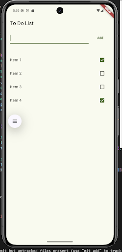

# To-Do List Application (UI)

This repository contains the **UI design of a To-Do List mobile application** developed using Flutter.
The project focuses on implementing the user interface components and layout for task management.

## Description

The To-Do List application provides a simple and clean interface for managing daily tasks.
This version of the project demonstrates only the **front-end UI**, without backend functionality or persistent storage.

## Features

* Add Task UI
* Task List Layout
* Task Item Design

## Technologies Used

* Flutter
* Dart
* Visual Studio Code
* Git

## Screenshots

### Home Screen

## Group 3 Members

* 22K-4376 Khubaib Ahmed Jamil
* 22K-4367 Ayan Hasan
* 22K-4482 Muhammad Ahmed